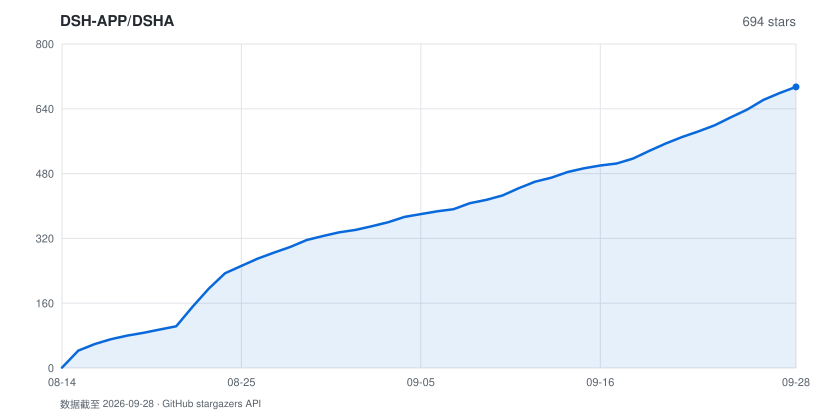

# DSHA

<p align="center">
  <b>DeepSeek Harness 安卓启动器</b><br>
  在手机上跑完整的 <a href="https://github.com/deepseek-ai/deepseek-harness">deepseek-harness</a> —— 免 ROOT，免 Termux，装完即用
</p>

<p align="center">
  <a href="LICENSE"></a>
  <a href="https://github.com/DSH-APP/DSHA/releases/latest"></a>
  
  
</p>

> **源仓库地址：** https://github.com/DSH-APP/DSHA
>
> ⚠️ **项目目前是半成品**：功能不完整，UI 混用 MIUIX / Kyant 液态玻璃 / Material 三套风格，**体验非常难用**，请谨慎使用。

---

## 这是什么

DeepSeek Harness（`@deepseek-ai/dsh`）是 DeepSeek 官方的 agent harness，类 Claude Code。
它是为 glibc Linux 写的，直接在安卓上跑会撞上一堆事：原生模块编译不过、`link(2)` 被
SELinux 挡住、沙箱起不来、前端按桌面布局排版。

**DSHA 把这些全部封在一个 APK 里。** 装 APK、填 API key（或跳过）、点启动 —— 不需要 Termux、
不需要 ROOT、不需要敲一行命令。里面是一个完整的 Ubuntu 环境：`apt` 能用、
交互式 PTY 能用、需要编译的原生模块能装，跟你在服务器上用是同一套东西。

---

## 技术栈

| 项目 | 说明 |
|---|---|
| UI 框架 | **Jetpack Compose** |
| 设计语言 | **MIUIX** + **Kyant 液态玻璃** + **Google Material 3** 混合 |
| 仿 KernelSU 布局 | [KernelSU-Style-UI-Kit](https://github.com/chenaizhang/KernelSU-Style-UI-Kit)（[示例 App](https://github.com/chenaizhang/KernelSU-Style-UI-Kit/releases/tag/v0.1.0)） |
| 状态 | ⚠️ **半成品**，功能不完整，体验非常难用，请谨慎使用 |

> 说人话：这个 APK 目前是个**半成品**，UI 混了 MIUIX、Kyant 液态玻璃和 Material 三套风格，
> 实际用起来**非常难用**。能跑，但别指望顺手。欢迎提 issue 或 PR。

主要依赖版本（`gradle/libs.versions.toml`）：

| 组件 | 版本 |
|---|---|
| Kotlin | 2.3.20 |
| AGP | 9.1.0 |
| Compose BOM | 2026.05.01 |
| Material3 | 1.5.0-alpha22 |
| MIUIX (KMP) | 0.9.4 |
| Lifecycle | 2.10.0 |
| Activity Compose | 1.13.0 |
| Navigation3 | 1.1.2 |
| NavigationEvent | 1.1.1 |
| kotlinx-coroutines | 1.11.0 |
| CommonMark | 0.28.0 |
| AndroidX WebKit | 1.16.0 |
| MaterialKolor | 4.1.1 |
| OkHttp | 5.3.2 |
| HiddenApiBypass | 6.1 |
| apksign (LSPlugin) | 1.4 |

---

## 下载

**安装包下载请看 [Releases](https://github.com/DSH-APP/DSHA/releases/latest)。**

两个版本共享 `com.dsh.client` 包名与数据，**不能并排安装**：

| 版本 | 适用设备 | 内核 | 大小 |
|---|---|---|---:|
| **Standard 标准版** | Android 11+ / arm64 | 系统 WebView；支持实验性虚拟屏 | 261 MiB |
| **Low 兼容版** | Android 6+ / arm64 | 内置 GeckoView 143；暂不支持虚拟屏 | 334 MiB |

- **升级**：用同签名 APK 覆盖安装即可（证书指纹 `e7e3a3…a53f5`）。
- **应用内更新**：「设置 → 检查更新」从官网 [`dsha.cc`](https://dsha.cc) 拉取发布清单。
- **历史版本**：[Releases](https://github.com/DSH-APP/DSHA/releases)。

### 30 秒上手

1. 装 APK（仅 arm64；Android 11+ 选 Standard，更老的系统选 Low）
2. 首次启动解压内置环境（几分钟，只有一次）
3. 「配置」页填 DeepSeek API key →「启动」页点启动 → 自动打开 Web UI

想跑得更细可以走「分步安装」，每步都能单独重装、单独更新。

---

## 为什么是 DSHA

|  | 说明 |
|---|---|
| 🚫 **零命令行门槛** | 内置离线 Ubuntu rootfs，APK 装完就能用。不装 Termux、不配 pkg、不敲命令 |
| 🐧 **完整 glibc 环境** | 不是裁剪版：`apt` / PTY / 原生模块 / Python / git 都在。上游插件不用改就能跑 |
| ⚡ **proroot 零 ptrace 开销** | 传统 proot 每个系统调用两次上下文切换；proroot 走 LD_PRELOAD + 二进制补丁做进程内路径翻译。真机实测关键项合计 **+58%** |
| 🔌 **手机就是 agent 的手** | 无障碍 + ADB 免 Shizuku 直连 + 独立虚拟屏：读屏、点按、装应用、跑自动化，全部内置 |
| 💾 **卸载重装数据不丢** | 对话与设置放在 `Documents/dshdata`，文件管理器里可见可备份；API key 走 Android Keystore 加密 |
| 🩺 **坏了能自己说清哪坏了** | 组件级自检 + 按需修补 + 启动诊断 + 独立应急 DSH；Web 起不来时直接点名是哪个插件 |

---

## 核心模块

### ① 装机与环境

| 能力 | 说明 |
|---|---|
| 内置离线 rootfs | Ubuntu 24.04 (noble) arm64 打进 APK，无网也能完成环境部署 |
| 六步安装流水线 | 解压 → 基础工具 → Node.js → pnpm → dsh → 补丁，每步先探测再执行、装完即校验 |
| 分步重装 / 更新 | rootfs、工具、Node、harness 相互独立，可单独重装，不重复下载 |
| 双装机路径 | 预构建包与源码构建都支持，源码路径自动处理 node-pty 等原生模块编译 |
| 离线工具链 | curl / git / Python / 证书随包锁定版本，不依赖用户先跑 `apt` |
| 镜像与网络 | apt 源官方 / 中科大镜像自动回退；DNS 三模式，AAAA 被拒时仅重试解析 |
| 基础环境版本化 | Ubuntu 基础环境独立编号；界面更新不重建环境 |

### ② 运行时

| 能力 | 说明 |
|---|---|
| proroot / proot 双运行时 | 默认 proroot（零 ptrace 开销），「配置」页一键切回 proot |
| 实测提升 | vivo V2352A / Android 14：关键项合计 +58%，tar 打包 +94%，stat 密集 +82% |
| 三层兜底 | 运行时文件缺失自动降回 proot；连续 3 次启动失败强制切回并告知 |
| Node.js 24 + pnpm 10 | 与上游一致的运行环境，随包锁版本 |
| 分包更新 | Ubuntu 与 dsh 运行时在 APK 内分包；局部更新只读 dsh 包 |
| 受管更新试运行 | 新环境先在隔离区真实启动、验证端口 / 鉴权 / 会话读写 / 插件加载，全过后才切换 |
| 前台服务 + 看门狗 | 通知栏可见运行状态；Web 掉了自动拉起 |
| 慢启动保护 | 等待鉴权不设强杀时限，看门狗不会把慢启动当故障误杀 |

### ③ 数据与备份

| 能力 | 说明 |
|---|---|
| 数据不随卸载消失 | 会话 / 设置 / 附件放 `内部存储/Documents/dshdata` |
| v5 加密备份 | `.dshbak` 密码派生密钥 + AES-GCM，先完整认证再预检 |
| 自动备份计划 | 默认开启：每天指定时间 / 每隔 1–168 小时 / 停止 DSH 后 |
| 分范围备份 | 全量 / 只对话 / 只插件 / 只设置任选 |
| 换机不丢对话 | 对话等热数据是指向公开目录的软链，备份会额外解引用快照 |
| 凭据不进备份 | 桥 token 整文件排除；`.credentials.yaml` 字段级剔除本机密钥 |
| 恢复极宽容 | 老备份一律放行；缺失插件后台自动补装 |
| 会话损坏隔离 | 坏掉的会话文件挪到 `corrupt-backup` 可取回 |
| 覆盖更新自动清理 | 升级后闲时清理可再生缓存与多余旧副本 |
| 完整格式化 | 核心数据严格删除并复核 |

### ④ 设备能力（让 agent 真正操作这台手机）

agent 通过本机 `127.0.0.1:3090` 桥调用以下能力（token 门控）：

| 能力 | 说明 |
|---|---|
| 屏幕操作 | **无障碍服务实现，不需要 ADB**：读屏、点按、输入、按键、滑动、截屏 |
| 独立虚拟屏（实验） | Standard 版 Android 11+：创建虚拟屏、启动应用、抓帧、操作 |
| ADB 无线直连 | 内置无线配对与保活，**不需要 Shizuku**，重启手机自动恢复 |
| Shizuku / Root 通道 | 备用设备命令通道，与 ADB 同受命令白名单约束 |
| 与用户交互 | 系统通知、App 内提示、震动、弹窗征询、分享 / 打开链接 |
| 文件交换 | 读目录 / 文本文件、导出产物到 `Download/DSHA` |
| 传感器与位置 | 光线 / 加速度 / 陀螺仪 / 磁力计 / 气压 / 步数 / 定位 / 手电筒 |
| 剪贴板 | 读写剪贴板（受系统前台限制） |
| 危险命令守门人 | 设备命令始终走白名单解析，拦截返回 `[POLICY_BLOCKED]` |
| 短信读取 | 独立敏感能力，仅限严格只读查询，默认每条确认 |

### ⑤ 终端

| 能力 | 说明 |
|---|---|
| 真 PTY 终端 | Termux terminal-emulator JNI 实现：vim / htop / tmux 等全屏 TUI 可用 |
| 手机键盘补偿 | 扩展键行（Ctrl / Alt / Esc / 方向键 / Tab），双指缩放调字号 |
| 多标签 | 多会话并存，跨切页 / 旋转 / 语言切换保持进程与状态 |
| 简易终端兜底 | PTY 在个别机型异常时可切回简易终端 |

### ⑥ Web UI 与访问

| 能力 | 说明 |
|---|---|
| 双内核 | Standard 用系统 WebView；Low 内置 GeckoView 143 |
| 移动端适配 | 内置 dsh-web-mobile（MIT）：窄屏单栏 + 目录抽屉、底部 sheet、安全区适配 |
| 画中画 | 对话窗口支持 PiP 小窗悬浮 |
| 高刷与省电 | 按用户刷新率上限请求高刷；空闲自动交还系统省电 |
| 深浅色与多语言 | 深色 / 浅色 / 跟随系统；简体中文 / English |
| 局域网访问 | 电脑 / 平板浏览器直接用手机上的 dsh，token 鉴权 fail-closed |
| 老浏览器兼容 | 自动注入 `AbortSignal.any/timeout` 与 `crypto.randomUUID` polyfill |
| 流式悬浮条 | AI 输出贴在屏幕顶部，工具调用翻译成人话 |
| 端口可配 | Web 端口自定义，冲突自动回退并说明 |

### ⑦ 插件生态

| 能力 | 说明 |
|---|---|
| 插件市场 | 安装 / 更新 / 启停 / 删除 / 搜索 / 排序，全在 App 内 |
| 多样安装方式 | GitHub 简写 / tree / blob / archive / Release 链接、HTTPS 压缩包直链、本地导入 |
| 多下载源 | 自动择源，支持 npm 官方源与 npmmirror |
| 依赖安全 | 随包 pnpm 原生锁冻结依赖摘要；禁用生命周期脚本与 pnpmfile 钩子 |
| 先审阅后启用 | 第三方插件安装后保持停用，由用户确认后才启用 |
| 硬依赖自动改造 | 插件写死的服务依赖就地改成运行时注入 |
| 内置插件保护 | 内置插件不可删除；用户禁用过的，升级后保持禁用 |

内置 7 个插件：`dsh-web-mobile`、`dsh-status-overlay`、`dsh-task-notifier`、
`dsh-device-shell-guide`、`dsh-computer-use-android`、`dsh-tool-vscreen`、
`dsh-auto-review`。

### ⑧ 可靠性与应急

| 能力 | 说明 |
|---|---|
| 安装与修复页 | 检查全部六项组件并按需修复，只处理失败项 |
| 诊断报告 | 环境检查 + 失败日志可导出；最近五次脱敏留存 |
| 启动恢复 | 明确的启动 / 插件故障自动进入恢复页 |
| 配置快照 | 配置变更前自动留快照，坏了能回滚 |
| 插件故障人话诊断 | Web 起不来时直接说「是插件 X、它要的服务不存在、点这里修」 |
| 独立应急 DSH | 正式环境损坏时进入独立应急环境 |
| 脚本增量热更新 | 关键脚本可从 GitHub 增量更新并离线验签 |

### ⑨ 安全（默认最小权限）

| 层面 | 做法 |
|---|---|
| 什么权限都不给也能用 | 最小配置下 DSHA 照常跑 dsh；每项能力默认关闭、随时撤销 |
| API key | Android Keystore + AES/GCM，密钥不出 Keystore |
| 设备命令 | 白名单始终开启，Root / Shizuku / ADB 三通道同一套策略 |
| 桥凭据护栏 | `/app/export`、`/app/readfile` 拒绝凭据区路径 |
| 无遥测 | 不上传任何日志或使用数据 |
| 诚实披露 | 已知弱点在文档里直接列出 |

---

## 已知限制

| 项目 | 状态 | 说明 |
|---|---|---|
| 项目完成度 | ⚠️ **半成品** | 功能不完整，体验非常难用，请谨慎使用 |
| UI 框架 | Jetpack Compose | 声明式 UI |
| 设计风格 | MIUIX + Kyant 液态玻璃 + Material | 三套混用，观感与交互不统一 |
| 架构 | ⚠️ 仅 arm64-v8a | 32 位与 x86 设备不支持 |
| 系统 | ✅ Standard 11+ / Low 6+ | 老系统部分能力受系统限制 |
| 包体 | ⚠️ 261 / 334 MiB | 内置完整 Ubuntu 环境的代价 |
| bash 工具 | ✅ 可用 | 完整 Ubuntu 的 bash，agent 跑 shell 命令没有限制 |
| bash 的**沙箱隔离** | ⚠️ 不可用 | bubblewrap 要 unprivileged user namespace，Android sepolicy 不给 |
| 卓易通 / 鸿蒙 anco | ❓ 未验证 | 理论可行，尚无真机回归 |
| 悬浮条 | ⚠️ 需要授权 | 用 `TYPE_APPLICATION_OVERLAY` 自绘 |
| 数据位置 | ⚠️ 需要文件权限 | 「所有文件访问」被拒时数据留在私有目录，卸载即丢 |

---

## ADB 无线配对（设备 Shell 能力）

配好之后 agent 就能直接操作这台手机，**不需要 Shizuku**。

**首次配对（约 1 分钟）**

1. 系统设置 →「关于手机」→ 连点「版本号」7 次开启开发者选项
2. 开发者选项 → 打开「无线调试」
3. 进入「无线调试」→「使用配对码配对设备」，记下 **IP:端口** 与 **6 位配对码**
4. 回到 DSHA →「设备能力授权」页 → 填入 → 配对

> 无线调试的配对码需要 Android 11+；老系统可走 Shizuku / Root 通道，或直接用无障碍能力。

**配对之后**：DSHA 自己维护连接（保活 + 重连），重启手机后也会自动恢复。

**验证**：内置终端里跑 `adb shell id`，输出 `uid=2000(shell)` 即成功。

---

## 构建

本地构建需要 JDK 17、Android SDK（API 37）、NDK 26 与 Python 3.9+。

```bash
bash build.sh                                # 默认构建 Standard Debug
bash build.sh :app:assembleLowRelease        # 构建 Low Release
bash build.sh :app:testStandardDebugUnitTest # 纯逻辑单测
python tools/verify-stability.py             # 稳定性验收门禁
```

离线 rootfs 不提交 Git。

---

致谢

· deepseek-ai/deepseek-harness —— 本体
· proot / proroot —— 免 ROOT 容器
· Termux terminal-view / terminal-emulator（Apache-2.0）—— PTY 终端
· dsh-web-mobile —— 内置移动端适配
· Shizuku —— 备用设备命令通道
· KernelSU-Style-UI-Kit —— 仿 KernelSU 布局
  （示例 App，
  如果有用欢迎三联支持，感激不尽 :-D）
· 感谢 DSHA 作者资助的 token，让 KernelSU-Style-UI-Kit 得以在项目中使用

---

交流

QQ 群 975836806 —— 测试版、问题反馈、插件交流。

事宜 联系
项目主创（合作/授权/入伙） QQ 2921185884
现维护者（项目提议/反馈，或直接提 issue） QQ 1876843459
Email 1437ht@gmail.com

---

许可

MIT。

---

第三方组件声明

DSHA 的 APK 内包含以下第三方二进制组件。

DSH 0.1.6-alpha.2 Office 预览

· 随锁定的 DSH 包包含 @deepseek-ai/libreoffice-kit@0.0.1 与 Linux 使用的 @deepseek-ai/libreoffice-kit-wasm@0.0.1，入口包声明 MPL-2.0；上游引擎、集成代码及第三方组件的声明分别保留在包内 NOTICE、licenses、sources 与 prebuilds.json 中。
· DSHA 仅补充 Android /system/fonts 到默认字体查找路径；使用已有系统字体，不额外复制系统字体。修改由 assets/office-fonts-patch.json 记录，用户明确配置的字体目录仍按上游规则优先使用。

rc2.1 宿主数据保护依赖

· Gson 2.13.1：仅使用受限 JSON 流式读写，不使用任意类型反序列化。许可为 Apache-2.0，随包全文位于 assets/licenses/gson-LICENSE.txt。上游版本与许可。
· Bouncy Castle bcprov-jdk15to18 1.85.2：使用轻量 PBKDF2-HMAC-SHA256 和 AES-GCM API，不注册或替换系统全局 Provider，也没有明文降级路径。许可全文从该 JAR 的 org.bouncycastle.LICENSE 导出，位于 assets/licenses/bouncycastle-LICENSE.txt。上游许可。
· 两个 flavor 均由 tools/backup-dependencies.lock.json 固定版本与 JAR SHA-256；Java 编译前执行 verifyBackupDependencies，不匹配即停止构建。JVM 测试覆盖 Node/OpenSSL 固定向量及 JCE 互操作；API 23 上的实际运行尚待用户安排的设备验证。

Termux 终端 JNI（标准版）

· 来源：termux/termux-app 的 v0.118.0，terminal-emulator/src/main/jni/termux.c。
· 许可：Apache-2.0（上游对 terminal-emulator 的许可例外，说明与许可全文保存在 tools/termux-jni/）。
· 在包内的位置：lib/arm64-v8a/libtermux.so。
· 标准版使用 NDK r26d 从同版本原始源码重新编译，保持原有 JNI 接口，设置 16 KB ELF 页对齐。
· 源码及复现命令：tools/termux-jni/termux.c、tools/termux-jni/build.ps1。

proot（Termux 分支）

· 来源：https://github.com/termux/proot
· 许可：GPL-2.0
· 在包内的位置：lib/arm64-v8a/libproot.so、libprootloader.so、
  libprootloader32.so、libtalloc.so、libandroidshmem.so
· 用途：默认的容器运行时，用 ptrace 实现免 root 的 chroot 环境
· 说明：文件名带 lib 前缀、.so 后缀是 Android 打包要求
  （只有这样系统才会把它提取到可执行的 nativeLibraryDir），
  内容未作修改

proroot

· 来源：https://github.com/coderredlab/proroot（v1.2.8）
· 许可：Proprietary。README 原文："Free to use in your projects.
  Redistribution of modified binaries is not permitted."
  —— 允许在项目中使用，禁止分发修改过的二进制
· 在包内的位置：lib/arm64-v8a/libproroot.so、libproroot-runtime.so、
  libproroot-linker.so、libproroot-stub-loader.so、libproroot-bridge.so
· 用途：默认的容器运行时（v1.1.6 起）。用 LD_PRELOAD + 二进制补丁做进程内
  路径翻译，没有 ptrace 的上下文切换开销，真机实测启动快 5~6 倍
· 分发的是官方 release 的原始二进制，未作任何修改，sha256 与
  上游 release notes 一致：

```
a4e74d75b66cdc02b080adfe863dbf9951c3b30610d77beddc95488d5fe5de01  libproroot.so
8c47a0a7db32d84c179ebb5bf3640f655a3181860ece5886ae44d92858730c34  libproroot-runtime.so
1c5bc9537a270e8bf8b1c70222813f57b60b828bfb5503ddf8fe37685092de2f  libproroot-bridge.so
51a0ec5bfed00e572a0de09e22d9057e2befc386b78e426613d3e0ab03f4ecee  libproroot-linker.so
06c6624db3bdc45b9ced151cd781df439a37b47731d244b93e9d6a58cd48cde0  libproroot-stub-loader.so
```

为什么随包分发而不是按需下载

Android 10+ 的 W^X 策略不允许从应用可写目录（filesDir）执行代码。
下载到 filesDir 的 .so 无法执行，只有放进 APK 的 jniLibs、
由系统提取到 nativeLibraryDir 才能跑。现有的 libproot.so 同理。

用户可控性

· 默认启用（v1.1.6 起），可在「配置」页取消勾选改用传统 proot
· 不参与装机路径（解压、安装六步一律用 proot），只影响「执行命令」这一层
· 运行时文件缺失时自动降回 proot
· 连续 3 次启动失败会强制切回 proot 并告知用户
· 因此最坏情况是这一层退回 proot，不会导致环境不可用 ——
  这是敢把闭源组件设为默认的前提：它不可用时系统自动绕过它

已知限制

· 上游未公开源码，无法审计，出问题只能等作者修
· 作者已将开发重心转向另一个项目（proroom），更新频率会下降
· 因闭源，Termux 官方仓库拒绝收录（见 proroot issue #21）

内置移动端适配插件（dsh-mobile-nav）

· 上游：mexiaosqwq/dsh-web-mobile
· 包名：@dsh-external/dsh-mobile-nav
· 版本：v2.1.1（按 tag 固定，不跟 main 漂移）
· 许可：MIT —— 许可证全文随文件一并分发于 app/src/main/assets/mobile-nav/LICENSE

随 APK 分发的是上游仓库里的构建产物，未作任何修改：

文件 sha256
lib/client.js 6c6ee969b3de2d7f04eafd4b70319c8f9c8891a72a21090fb5878636be6b2e04
lib/index.js 855d07192c12ac831830e87246216dbc74ad8c83a6d67ae00ee7e89a378591ef
package.json b80273b3cb53a7c2aac643a6838c7d4d39f98374c22ee467692f977d41fc61ab
cordis.patch.yml 427367650ec107cf5fd35cc6496398c629680f57cd6f7b980a3622fd70e082ef
LICENSE 0d50650e8ee0e00996facf70e6d246dddb836e27c4ce7027cdcf800ac5758f4b

为什么随包分发

装机要离线可用，这是相对同类项目的主要优势；而移动端适配是「手机上能不能正常用」
的前提，不该依赖首启联网。插件是单文件构建产物（~132KB），纯前端 DOM/CSS 改造 ——
零网络请求、无 eval/new Function，外部依赖只有官方浏览器侧共享的 react 与
@deepseek-ai/dsh-client-ui-primitives，随包带上代价很小。

关系说明

我们只负责把上游产物打进 APK 并做安置/注册，插件的功能与 UI 行为归上游维护。
界面细节问题建议直接反馈到上游仓库。

替换历史

这次更换之前内置的是 dsh-client-ui-mobile-adapt
（Hotsteel2901，MIT），
因作者长期停更而换掉。升级时 App 会自动把旧插件从 profile 的 bundles /
dependencies 摘掉并删除实体（migrateLegacyMobileAdapt）—— 两个插件改造同一批
DOM 元素，同时激活会互相打架（抽屉/浮层出两份、事件绑定两遍）。如果你此前手动
禁用过旧插件，新插件会沿用「已禁用」状态，不会被悄悄打开。

其他

· 随包 CA 证书来自 certifi 2026.7.22 / Mozilla 根证书集合（MPL-2.0），许可证随 assets/licenses/certifi-LICENSE.txt 提供。
  构建脚本 tools/build-standard-runtime.py 固定官方下载地址与 SHA-256；没有关闭 TLS 验证。
· low 兼容版内核：GeckoView 143.0.20251003115653（MPL-2.0），来自 Mozilla Maven；
  对应源码。
  后续 Firefox Android 提高了最低系统要求，因此保留兼容 Android 6/7 的这个版本，仅用于本机 dsh 预览。
· low 兼容版容器：Termux proot v5.1.107.92（GPL-2.0），
  上游源码；API 23 编译配置、兼容函数和 fd 断言补丁完整保存在
  tools/build-low-proot.py，脚本校验上游归档 SHA-256 后可重现构建。COPYING 随兼容包资产分发。
· 标准版补充资产 python-support.bin：Ubuntu 24.04 arm64 的 libsqlite3-0 3.45.1-1ubuntu2.7、
  libreadline8t64 8.2-4build1，未修改二进制。版权文件随包保存在容器 usr/share/doc。
  对应源码：sqlite3、
  readline。
· pnpm-runtime.bin：pnpm 10.34.5（MIT），来自 npm 官方发布包，保留许可证，省略其他平台的可执行文件。
  源码；可用 tools/build-standard-runtime.py 按固定校验值复现资产。
· Ubuntu arm64 rootfs（assets/offline-rootfs.bin）：各软件包遵循各自许可
· GeckoView（libxul.so 等）：MPL-2.0
· @deepseek-ai/dsh：见其 npm 包内的许可声明

npm node-semver 7.8.1

插件版本兼容性使用 npm/node-semver 7.8.1，遵循 ISC 许可。完整许可随 app/src/main/assets/plugin-semver.cjs 一并分发；生成方式见 tools/vendor-plugin-semver.cjs。

0.1.6-alpha1 运行时扩展

完整依赖和摘要锁定在 tools/dsh-runtime/package-lock.json，原 npm 包的许可文件保留在离线运行时中。新增主要组件按发布包声明：

· DSH 0.1.6-alpha.1 及其 Browser Use、Computer Use、Auto review、Team、SSH 等官方组件：见各包随附许可。
· @trycua/cua-driver 0.28.0：MIT；Linux arm64 原生可选依赖一并保留。
· @browserbasehq/stagehand 4.1.0：MIT。
· @playwright/mcp 0.0.80：Apache-2.0。
· chrome-devtools-mcp 1.9.0：Apache-2.0。

DSHA 的 Android Computer Use 适配层和独立会话启动器为本仓库实现，沿用本仓库 MIT 许可；未替换上游 Cua Driver 的实现或将其标为 Android 原生驱动。

KernelSU-Style-UI-Kit

· 项目地址：https://github.com/chenaizhang/KernelSU-Style-UI-Kit
· 示例 App：https://github.com/chenaizhang/KernelSU-Style-UI-Kit/releases/tag/v0.1.0
· 用途：DSHA 的仿 KernelSU 布局
· 许可：以项目仓库声明为准（使用前请自行确认）

如果有用欢迎三联支持，感激不尽 :-D
感谢 DSHA 作者资助的 token。

UI 框架与依赖

DSHA 的 Android 界面使用 Jetpack Compose 编写，混合使用
MIUIX、Kyant 液态玻璃 与 Google Material 3 三套设计语言。

依赖版本锁定在 gradle/libs.versions.toml：

组件 版本 许可
Kotlin 2.3.20 Apache-2.0
AGP 9.1.0 Apache-2.0
Compose BOM 2026.05.01 Apache-2.0
Material3 1.5.0-alpha22 Apache-2.0
MIUIX (KMP, top.yukonga.miuix.kmp) 0.9.4 Apache-2.0
Lifecycle 2.10.0 Apache-2.0
Activity Compose 1.13.0 Apache-2.0
Navigation3 1.1.2 Apache-2.0
NavigationEvent 1.1.1 Apache-2.0
kotlinx-coroutines 1.11.0 Apache-2.0
CommonMark 0.28.0 BSD-2-Clause
AndroidX WebKit 1.16.0 Apache-2.0
MaterialKolor 4.1.1 Apache-2.0
OkHttp 5.3.2 Apache-2.0
HiddenApiBypass 6.1 Apache-2.0
apksign (LSPlugin) 1.4 Apache-2.0

上表许可为常见声明，发布前请以各依赖包内 LICENSE 实际内容为准，
并确认 Kyant 液态玻璃组件的具体来源与许可。

Star History

<a href="https://github.com/DSH-APP/DSHA/stargazers">
  <picture>
    <source media="(prefers-color-scheme: dark)" srcset="docs/star-history-dark.svg" />
    <source media="(prefers-color-scheme: light)" srcset="docs/star-history.svg" />
    
  </picture>
</a>

<sub>由 tools/gen-star-history.py 按周读取 GitHub 星标时间并更新（workflow）。浅色、深色 SVG 保存在本仓库；曲线按当前仍保留的星标汇总。</sub>

