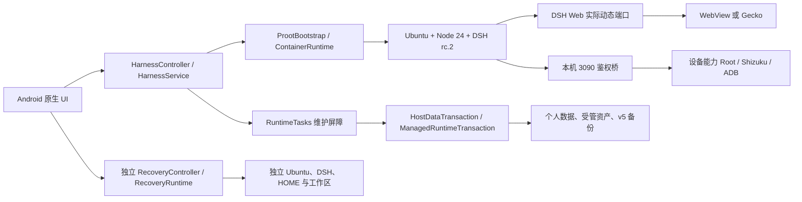
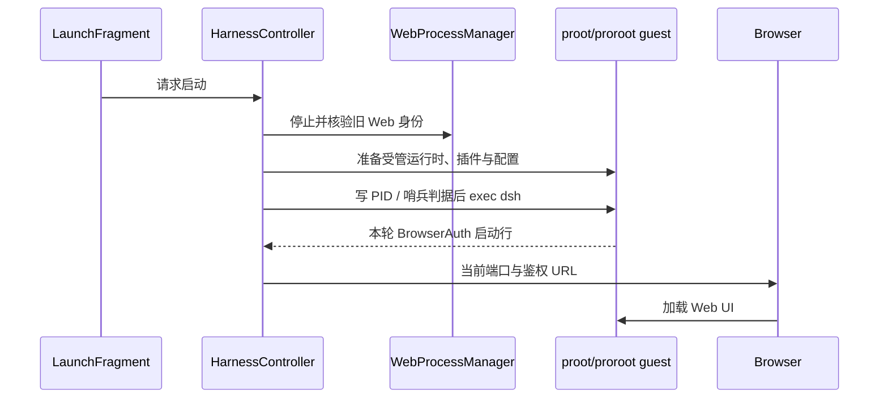
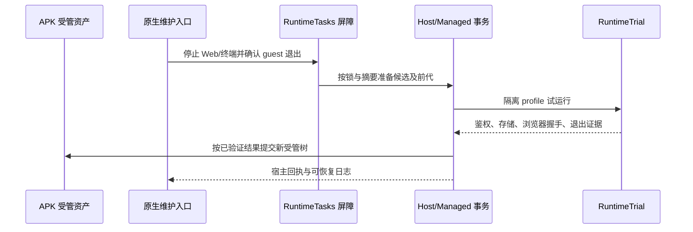
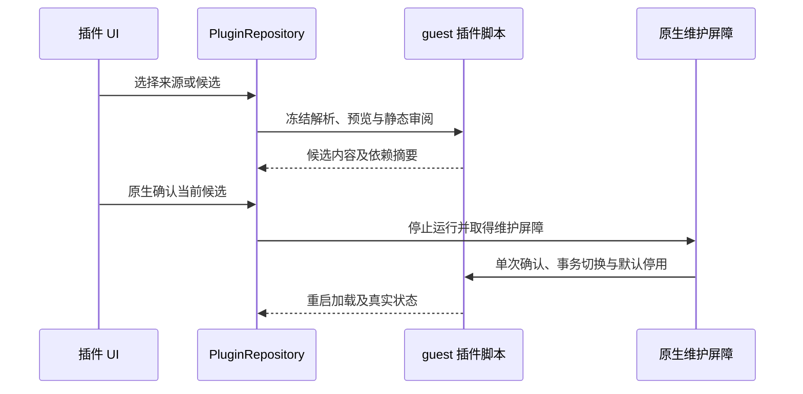

# DSHA 0.1.7-rc2 修复前架构审计

本报告对应 `baseline.json` 中的本地工作树，包括参与当前产品的未提交与未跟踪源码。六个工作包的修复前静态审计及主代理交叉复核已完成，动态复现和修复后评分尚未完成。问题清单见 `findings.md`，覆盖层级见 `coverage.csv`。这是对当前实现的有证据工程判断，不是对所有设备和所有历史数据的认证。

## 实际架构

DSHA 是一个 Java 17、单 Android 模块的宿主应用，Standard/Low 共用业务代码。宿主将离线 Ubuntu 和锁定的 Node/DSH 运行时解包到应用私有目录，借 proot/proroot 启动 guest Web。前端使用 Standard 的系统 WebView 或 Low 的 Gecko；宿主通过本地鉴权桥与可选 LAN 代理提供设备能力。正式运行时和应急 DSH 有各自的归档锁与解压运行根。Host 数据事务和 v5 加密备份管理个人数据，不从 APK 版本号推导数据格式。

主 Web 启动链：

受管更新及恢复链：

插件启用链：

以上图表示代码中的主路径；异常、取消和旧版本路径的偏差在问题台账单列，不能从图本身推断它们已通过。

## 已核对的结构指标

- 固定基线列举并校验 1,306 个当前相关文件：119 个关键入口/脚本已深读，232 个产品 Java 文件完成 import 与风险模式扫描，405 个文本源有语法检查，17 个二进制做元数据/摘要核对，533 个测试、文档、资源及生成类型文件仅列举或由专项工作包抽查。`coverage.csv` 对每项记录具体层级和负责人；“列举”不冒充深读。被忽略的构建缓存、历史 `tmp-*` 上游快照、旧 APK 不作为本轮自研源码计量；当前 `release` APK 另行核对摘要、包信息与签名。
- `app/src/main/java` 加两个 flavor 共 324 个产品 Java 文件，约 37,388 行；151 个 Java 测试文件约 8,944 行。`tools/` 与 `scripts/` 的 121 个 Python/JS/Shell 文件约 12,016 行。均按当前本地文件计数，未把历史源码快照与二进制并入产品代码规模。
- `util/` 有 105 个 Java 文件，静态导入扫描未发现 Android API import；99 个有同名 `*Test.java`。同名测试只是可测性线索，不能当作实际执行通过或完整路径覆盖。
- 最大的几个产品 Java 文件为 `HttpShellService`（约 1,581 行）、`ProotBootstrap`（约 1,413 行）和 `HarnessController`（约 860 行）。大小本身不是缺陷；审计重点是其中的职责、状态和变更耦合。
- 按显式 import 统计，`root` 包与 `core` 有双向依赖，`runtime` 也依赖 `backup` 的类型。完全限定名调用未计入，图只是依赖下界。`root` 同时容纳 Service、Provider 和设备能力入口，包名并不是一个完整架构层。
- 本轮静态语法扫描：110 个 JS、80 个 Python、46 个 JSON、148 个 XML、24 个 Shell 和 4 个 PowerShell 文件均可解析。源树 hash 复核没有发现审计期间的并发漂移。这不证明行为正确；Java 的完整编译、Gradle 配置和原生 ELF 仍留给修复后的门禁。

## 核心亮点与其边界

- `util` 的纯逻辑隔离与大量同名 JUnit 类让关键策略可在宿主验证；真实 Android/内核行为仍需要设备证据。
- Web 停止用哨兵、PID 出生身份和进程核验，避免按端口或名字盲杀；不确定身份应保持维护屏障。具体全局扫描判据仍有待裁决，见 `findings.md`。
- `HostDataTransaction` 和受管更新使用候选、摘要、日志及恢复入口，`RuntimeTrial` 隔离验证启动与存储后才提交。多套历史事务仍并存，操作记录容量问题已进入问题台账。
- 独立应急 DSH 具有自己的归档锁、运行根、HOME/工作区与受控工具，网络修复建议不能直接确认写入；它和普通安全 Profile 的定位不同。
- v5 归档先认证再做恢复预检，并区分系统插件当前 APK 字节与用户插件数据；恢复暂存清理的缺口已进入问题台账。
- HTTP/LAN 路由有头部字节、总期限、连接和流量配额，桥使用独立 token。设备能力是应用层策略，不是对同 UID 任意插件代码的 OS 级沙箱；因此每个可达特权入口都必须核对同一授权。

## 债务形成机制：目前已有证据

1. **历史兼容与多语言边界扩大了状态空间。** Android Java、guest Python/Node/Shell、JNI、WebView/Gecko、proot/proroot 与不同数据代次要在同一 APK 生命周期中协同。这是产品目标产生的必要复杂性；其风险取决于每条跨边界链是否有唯一的状态所有者和失败收敛。
2. **入口复用不等于授权复用。** 受原生确认保护的虚拟屏接口之外，通用设备命令仍可启动同一 Core。`DeviceShellPolicy` 以命令形状而非能力来源判断，在 Root 通道也允许对敏感数据库按普通文件读取。详见 SEC-01 至 SEC-03。
3. **保留历史与固定容量上限冲突。** 备份和受管更新都有 64 个事务目录硬上限；正常成功/失败历史按数据保护原则保留，却缺乏不会删错原件的安全容量策略。详见 DATA-03、RUN-01。
4. **暂存与恢复现场缺少统一终态。** 恢复、配置重置和通用原子写入各自留中间文件；哪些必须留作回切、哪些在确认完成后应清除，未由统一生命周期判定。详见 DATA-01、DATA-02、DATA-04。
5. **上游适配改变了本地状态，却没总是同步下游证据。** 插件恢复改写 `package.json` 后仍带旧依赖快照；构建描述符实际读取的文件比 Gradle 登记的输入更多；生成 assets 目录不能完全收敛已删除文件。`plugin-dependencies.py`、`PluginRestoreGraph`、`prepare-runtime-descriptor.py`、`app/build.gradle` 和两个资产生成器给出了具体证据。复杂度的一部分来自必须追踪 rc2 与 Android 的差异；债务来自证据/输入契约在各层重复维护而发生漂移。
6. **资源留存与页面生命期混淆。** 上传副本只在整个 retained 预览结束时清理；移动插件过期手势记录对旧 DOM 保持强引用；应急页面复用未重同步 locale。见 UI-01 至 UI-03。主预览长期保留是为跨旋转不中断会话服务，但资源与语言状态应另有有界生命周期。

这些结论的历史依据是仓库中从旧 `BackupManager`、根包 Service 向 `backup/`、`core/` 分层的仍在进行的重构，以及 rc1→rc2 的补丁与迁移记录。当前导入图仍有 `root ↔ core` 双向边；旧路径和新事务并存。**具体作者动机及每个旧分支为何保留，代码和 Git 记录不足以完全证明，不能凭文件名臆断。**

## “屎山程度”与架构定性

它更像**防御性较强的模块化单体 Android 宿主 + 嵌入式 Linux/DSH 运行时 + 多语言适配桥**，而非没有边界的单一巨型类。真正的治理问题是跨层授权、事务终态和构建输入证据没有始终保持唯一权威来源。大型类是审查热点，不凭行数独立定罪。

评分规则：各项 0 表示健康、5 表示严重，乘以权重后换算为 0–100，越高技术债越重。这里只评审当前可观察架构和本轮静态确认缺口；性能、厂商 ROM 与历史升级矩阵仍须动态验证。

| 维度 | 权重 | 修复前 | 加权贡献 | 依据及反证 | 置信度 |
|---|---:|---:|---:|---|---|
| 职责与依赖边界 | 20% | 3.0/5 | 12 | `root ↔ core`、屏幕能力双入口；`util` 纯逻辑与独立 recovery 是反证 | 中高 |
| 状态、并发与生命周期 | 20% | 3.5/5 | 14 | 多套日志容量悬崖、PTY 未证实的收敛风险；PID 身份与 RuntimeTasks 门禁是反证 | 中 |
| 数据事务与故障恢复 | 20% | 3.5/5 | 14 | 明文暂存、配置密钥副本、`.previous` 卡点；HostDataTransaction 的摘要/日志恢复是反证 | 中高 |
| 补丁与兼容负担 | 15% | 3.0/5 | 9 | 恢复图/依赖快照失配、rc2 插件版本缺口；上游源码锚点和锁定补丁是反证 | 中 |
| 测试与交付可信度 | 15% | 3.0/5 | 9 | 当前综合脚本读旧运行时、Gradle 输入遗漏及生成目录残留；两 flavor 大量 JUnit 与已有正式包证据是反证 | 中高 |
| 性能与可诊断性 | 10% | 3.0/5 | 6 | 上传缓存与 DOM 旧节点可持续增长；实际长会话设备性能尚未测量，已有分阶段启动日志和针对性夹具 | 低中 |
| **总分** | **100%** |  | **64/100** | **技术债偏重，但边界与测试基础允许分批治理** | **中** |

该分数不是“代码质量百分比”，也不表示项目有 64% 的代码需要重写。若设备/夹具验证推翻某条静态推断，必须连同证据调整对应维度。修复后沿相同维度重新评分，另列功能、数据和权限验收结果。

## 修复方向与验收基准

- 特权入口使用一致的能力来源与原生授权，虚拟屏受管启动和设备命令分离；Root 的原始文件读取不得绕过短信专用授权。保留官方允许的设备操作并对权限降级、撤销和未知结果做回归。
- 把事务记录的活跃状态、已封存历史和异常现场分开；不再用历史总数当作永久启动上限。加密恢复、配置重置及小记录原子发布在确认终态后清理敏感暂存，未知现场保留可恢复证据。
- 恢复插件的内容与依赖快照要由实际重建树重新核对；第三方包在启用前符合 rc2 活动插件元数据契约。旧版本依赖不重新解析最新版本。
- 构建生成目录按本轮完整输入收敛；Gradle 输入与生成脚本一致；综合门禁从当前锁定运行时验包并串起插件、应急和移动端行为检查。真机正式 APK 的 E7E3 非破坏性覆盖与软件门禁分别给出证据。
- 上传缓存、移动 DOM 手势标记和应急网页 locale 分别采用有界资源或明确生命周期；性能改善用同场景修复前后测量，不能以未测的推断充数。现有 100 条合成聊天渲染基线见 `chat-render-baseline.json`，属于宿主浏览器夹具，不代表真机体验。
