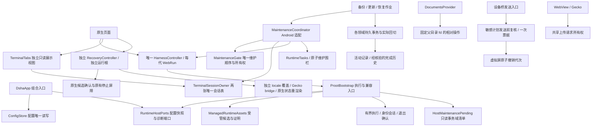

# 第二轮结构变化与架构定性

最终gate19两flavor各801项JUnit（各1项既有跳过、0失败/错误）、Release Lint及32个软件命令门禁通过；最终两份E7E3正式APK各15/15设备合同通过并交付release。评分、APK摘要和边界见[最终报告](final-assessment.md)及[问题台账](final-issue-status.md)。修复前16份封存文件保持原摘要。

DSHA 仍是**带受管 Linux/Node 运行时的防御性 Android 模块化单体**。单 APK、单 Gradle 模块并不意味着没有边界；需要判断的是状态由谁持有、谁可开始写入、失败后谁证明进程和事务结束。Java 宿主负责生命周期、授权和数据保护，Ubuntu/Node/DSH 提供业务运行环境，WebView/Gecko负责网页呈现。proot/proroot 与宿主同 UID，应用层门禁不能描述成操作系统沙箱。

## 已迁移的责任

图中维护适配器将平台端口交给纯维护策略执行；实际数据写入仍在既有领域事务中。只读视图沿用同一标签表，父 fd 使用既有 FS，均未复制第二套 registry/事务框架。这些纵切面减少竞争状态，**不表示全部 Java 包依赖已经无环**。

| 边界 | 新的单一事实或责任 | 兼容与失败条件 |
|---|---|---|
| 维护 | MaintenanceGate 持有锁、owner和独占顺序；Coordinator绑定实际平台动作 | 关闭终端、停止Web、确认guest、取得围栏后才写入；主线程提前拒绝阻塞等待 |
| 终端 | TerminalSessionOwner 持两张唯一标签表、简易会话输出与草稿；UI 只拿不可转回可变表的 `TerminalTabs.ReadOnly` | 永久 ID 与显示编号分离；按同一 ID 关闭；失败保留标签、编号及工作锁；界面解绑不停止会话；A07已通过最终双包软件/设备门禁 |
| Web | 唯一生产Controller；WebRun按generation持有launcher、bridge、鉴权、端口 | 迟到回调重新核对代次；旧PID身份不明时保留屏障，不按端口或名称猜杀 |
| 配置 | ConfigStore生成同次只读快照；runtime只读端口 | 模式、DNS和启动参数在同次调用一致；下一调用重读；独立应急不读取正式配置端口 |
| guest执行 | 退出码、超时、截断与输出分开；关键调用先验完成结果；简易终端 READY 也绑定本次出生时刻 | 旧文本接口仅作适配；有界 proroot 核验整个 session；简易会话不再按裸组号发信号，未知保留围栏 |
| 插件 | 安装/卸载持久事务；取消预览先确认进程结果与严格JSON状态 | 原件、失败候选和日志保留；清理未确认不报成功；界面可明确重试或稍后处理 |
| 历史 | 活动事务参与普通门禁；经证明的完成历史单独保留 | 旧v1、修改过和未知原件不凭缓存证明搬迁或删除；显式历史操作再次验证实物 |
| 历史展示 | 单页候选堆与游标、多选一次元数据扫描 | 游标变化刷新首页；重复原件均可见且拒绝模糊操作；恢复不使用展示结果作授权 |
| SAF 写入 | DocumentsProvider 创建/改名/删除走固定父目录 fd 的 NOFOLLOW 相对操作 | 旧文档 ID、树授权与末端链接删除语义保持；同 UID 写者换父路径不会重定向目标，fsync 未知结果不自动重放 |
| 敏感设备发送与虚拟屏 | ADB SMS 在唯一发送前重取相同授权计划；虚拟屏撤销在调用线程推进 epoch 并取消旧启动票据 | 已发出请求不可追溯撤回；旧排队 cleanup 不清新会话；普通 HTTP 已准入后撤销的在途边界保留 |
| 受管输入 | 同一签名输入表供安装、摘要和Gradle使用 | 缺失输入失败；原始锁、补丁输出、APK和软件回执保持可追踪 |
| 应急网页与语言 | 锁定独立原始归档→前置 HTML/PDF/locale 覆盖→独立最终身份；合法独立 Gecko native app 名；原生 READY 状态按当前语言重渲染 | 包内字节可去重而运行根仍独立；网页 locale 服务与原生界面双向切换，未知原始失败输出不翻译；设备合同仍按候选 SHA |
| 系统语言 | API33以LocaleManager真实systemLocale为首次权威，Application直接写平台locale；旧探测晚返回不能覆盖 | API23–32沿早锁存兼容路径；只重建UI，最终双包活Web与终端PID保留 |
| 上传 | 共享retained ticket/代次/缓存所有权 | 内核适配和来源策略仍分别保留；迟到选择或复制完成不能交给新页面 |
| 交付 | 依据已交付基线与实际源码差异选择设备行为 | 软件通过与设备通过分开；源码、日志、APK字节不一致不能复用通过证明 |

## 核心亮点与成立边界

1. **失败时保留恢复依据。** PID出生身份、guest与launcher分别确认、维护围栏和持久事务使“暂不能确定”保持阻断。成立条件是判据真实且调用链不绕过；无法读进程身份不是成功退出。
2. **个人数据与受管组件分离。** 组件由签名资产和精确摘要重建，用户对话、插件和文件保持原位或保留可核验原件。旧运行时可用性还需当前数据格式证据和实际试运行，不能由版本号猜测。
3. **独立应急根。** 正式环境损坏时仍可启动单独的诊断环境；它不能靠HTTP接口批准正式写入。临时模型凭据、原生确认和恢复lease各有生命周期。
4. **供应链与交付可复核。** 锁定依赖、补丁锚点、生成摘要、E7E3签名、ELF和候选证据形成连续记录。一个成功构建不能替代设备验收；一台Android13设备不能代表Android6/7或16KiB内核。

## “屎味”的具体来源

主要债务来自跨宿主、脚本和网页的规则分散：同一个成功条件、维护域、受管输入或页面代次曾在多处独立维护。故障修复不断追加到编排类后，错误文本逐渐承担了协议和状态判断；正常启动又背上越来越多历史记录的扫描成本。局部方法看似安全，组合时却容易在提交后清理、旧回调和未知进程退出之间产生空隙。

这一轮的有效变化是减少竞争权威和重复事实，并将关键完成条件变成可以验证的接口。拆文件、增加测试数量和改名本身不构成降债。剩余的多运行方式、双浏览器、离线资产、原生授权与旧数据兼容有产品原因，不能为了分数删掉。

## 验证边界

已确认错误、结构债、设备待验与必要复杂度必须分别记录。DocumentsProvider 父路径替换已在隔离 Android 现场复现并由父 fd 相对操作收口，但 app UID/多 ROM 的 SAF 验收仍受最终合同约束；ADB 敏感发送前复核与虚拟屏旧票据即时失效也不意味着已发出的网络请求可撤回。完整 Root/Shizuku/ADB 撤销矩阵、所有历史用户档与掉电持久性未由最终gate19自动证明。未知原件与受损现场仍保留。最终评分沿封存六维权重和 0.25 刻度，不从目标 20 倒推。
