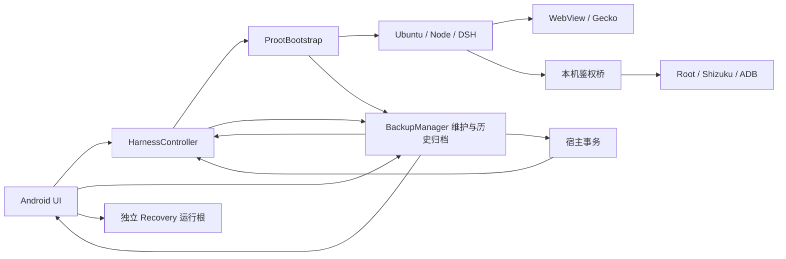

# 第二轮架构定性与评分契约

当前是带多语言运行时的防御性 Android 模块化单体。Java 宿主、app 私有 Ubuntu/Node/DSH、双浏览器、三种设备通道是必要产品复杂度。独立应急运行根、PID 出生身份、v5 认证归档、冻结插件依赖及内容确认、受管摘要和双 flavor 门禁是保留的核心亮点。源码约束用于应用层协作，不是同 UID 任意代码的 OS 沙箱。

## 实际边界

主路径：启动检查→维护探测→身份停旧→受管/插件/迁移准备→本次 launcher→官方鉴权→内核；维护：独占环境 lease→关闭终端→身份停止 Web→原子 RuntimeTasks 围栏→领域事务→验证→提交/保留。问题不是没有保护，而是停机权威、进程级状态与业务入口互相反向依赖；相同后置条件在不同分支分叉。卸载临时目录不具备跨进程事务寿命，是局部临时成功路径超过自身适用范围的实例。

全限定引用/显式 import 下界见 dependencies-before.json。该图不解析反射、动态脚本和同包隐式引用，不把扫描图当作完整语义图。覆盖分类见 coverage.csv，三组真实深读另有 coverage JSON，静态命中仅为线索。

## 修复前冻结评分规则

六维权重沿用上一轮；0健康、5严重，总分为 Σ(score/5×weight)。允许0.25级中间值，必须给证据和理由。不是代码质量百分比，也不是统计概率。

通用锚点：0＝本轮关键路径无已知实质债且边界、失败行为可证；1＝少量局部债、单一权威与可测试接口，修改波及受控；2＝仍有重复契约/跨层耦合或关键验证缺口；3＝多个竞争状态/跨域协议漂移或可复现的数据/授权错误；4＝普遍缺乏恢复/权限保护、修改广泛破坏；5＝无法确定权威或可靠恢复。未覆盖仅影响相关判断的置信度，不能直接等同失败，也不得当作通过。严重未解决问题单独阻断达标，不由平均分抵消。

| 维度 | 权重 | 本轮前 | 可降分的具体证据 |
|---|---:|---:|---|
| 职责与依赖边界 | 20 | 2.5 | 维护权威/Controller owner/有类型运行边界实际迁移，架构负向检查 |
| 状态、并发与生命周期 | 20 | 2.75 | 确认后代次复核、共享上传所有权、不同实例迟到回调证明 |
| 数据事务与故障恢复 | 20 | 3.0 | 卸载持久事务和全边界恢复、历史目录迁移与未知原件保护 |
| 补丁与兼容负担 | 15 | 2.0 | 单源输入、安装/描述符双向契约、应急兼容注入的真实时序 |
| 测试与交付可信度 | 15 | 1.75 | 本轮变更验收契约、真实签名包行为证据及未覆盖透明化 |
| 性能与可诊断性 | 10 | 2.5 | 历史增长扫描成本受控、具体阻塞原因、资源所有权与前后测量 |
| 合计 | 100 | **49.25/100** | 中等置信度；修复后按本页同一规则复核 |

上轮表格实际加权45.5，文字约46。本轮升至49.25来自新增卸载中断证据、敏感确认代次遗漏和变更验收契约欠缺，不倒推期待数值。代码只是移动/新增接口或测试数量增长不降分。每项降分须在最终报告绑定问题、结构/行为改变、测试和残余风险；尽量由非实现代理交叉复核。低于20需要整体落到“局部债且边界可证”附近，不能预先承诺。

## 性能判据（测量前确定）

历史门禁使用隔离文件系统0/65/1000条已完成记录：分开一次兼容迁移和稳定态读取；稳定态不应逐条读取全部已完成记录，新增活动/异常必须仍能发现。记录操作次数优先于宿主时钟噪声。

100条聊天六次挂载前后，内容行数/HTML字节必须保持；中位耗时恶化同时超过20%和10ms时需调查，不能靠重跑丢弃坏样本。设备内存/FD/PSS采用相同路径与多个样本，观察释放后是否持续增长，不用单个峰值或桌面结果推断耗电。缺少真实内核/外部服务时分别标未测。
